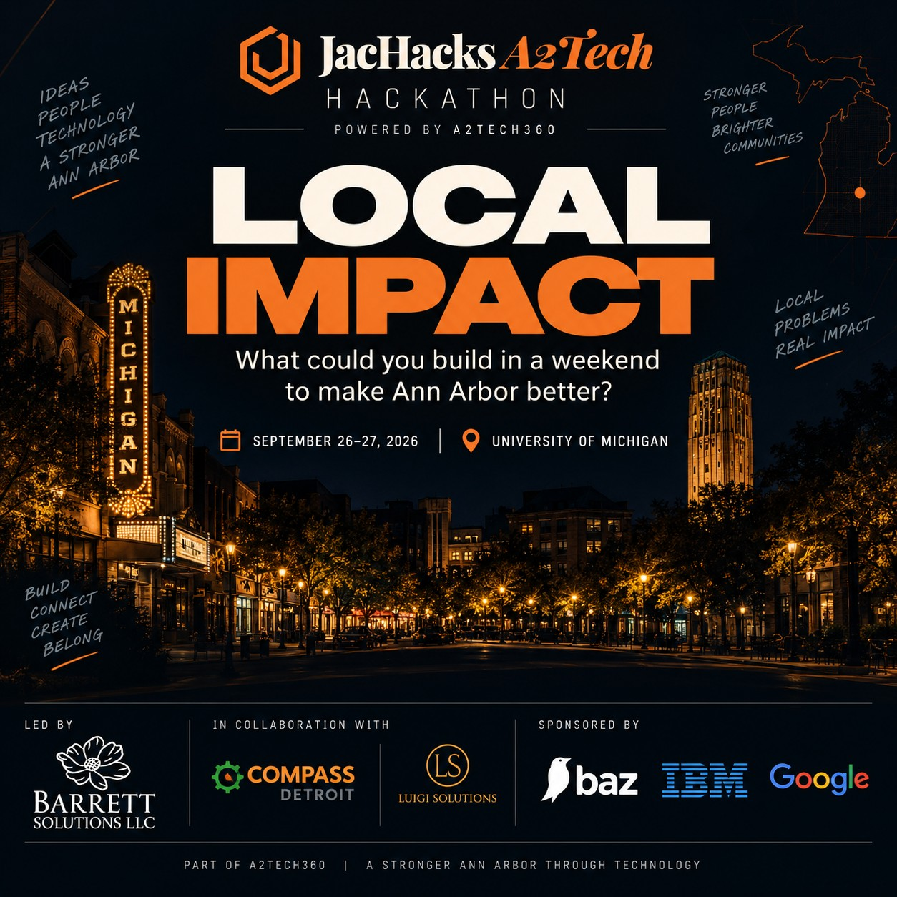

  

# A2Tech360 Hackathon Starter Kit · JacHacks A2Tech

**September 26–27, 2026 · Leinweber Computer Science and Information Building, University of Michigan, Ann Arbor**

The official hackathon of [a2Tech360](https://a2tech360.com), Ann Arbor Tech Week. This starter kit is your home base for the weekend: the schedule, Jac and Jaseci resources, setup steps, cloud credits, the Local Impact track, and the submission checklist.

💬 **Discord:** [discord.gg/Av2JKhVyA](https://discord.gg/Av2JKhVyA) for announcements, team matching, and help (**#ask-an-organizer**).

> Star this starter kit so you can find it again, and share it with your team.

---

## ✅ Your first 30 minutes

| # | Do this | Link |
|---|---|---|
| 1 | Join the Discord (announcements, team matching, mentors). Ask in **#ask-an-organizer**. | [discord.gg/Av2JKhVyA](https://discord.gg/Av2JKhVyA) |
| 2 | Register on the IBM hackathon site: cloud account, labs, tutorials, team formation | [ibm.biz/a2tech360](https://ibm.biz/a2tech360) · [guide](docs/ibm-setup.md) |
| 3 | Join the Google Group, then **claim your $25 Google Cloud credits today** (they expire after the event) | [guide](docs/google-cloud-credits.md) |
| 4 | Form your team (1–5 people; solo is fine) and create your project repo in the **A2Tech360 GitHub org**. **Baz** is already installed there and reviews your pull requests automatically. | [Baz guide](docs/baz-code-review.md) |
| 5 | Get started with Jac: docs, Jac-GPT, Jaseci Discord, JacHammer, quick start | [starter/](starter/) |
| 6 | Star the Jac repo (a Devpost requirement) | [github.com/jaseci-labs/jac](https://github.com/jaseci-labs/jac) |

**WiFi:** `eduroam` (college credentials) or `MGuest`

| IBM | Google group | Google credits | Discord | Devpost |
|:-:|:-:|:-:|:-:|:-:|
|  |  |  |  |  |
| [ibm.biz/a2tech360](https://ibm.biz/a2tech360) | [groups.google.com/g/a2tech360-hackathon](https://groups.google.com/g/a2tech360-hackathon) | [g.dev/credits/a2tech360-hackathon-2](https://g.dev/credits/a2tech360-hackathon-2) | [discord.gg/Av2JKhVyA](https://discord.gg/Av2JKhVyA) | [jachacks-a2tech.devpost.com](https://jachacks-a2tech.devpost.com/) |

---

## 🕒 Event schedule

**Saturday, September 26**

| When | What |
|---|---|
| 9:00 – 10:00 AM | Check-in and networking |
| 10:00 – 11:00 AM | Opening and keynote (Prof. Jason Mars) |
| 11:00 – 11:30 AM | Hackathon briefing: rules, tracks, prizes, sponsor resources, judging, how to submit |
| 11:30 AM – 12:00 PM | Team formation and project ideation |
| **12:00 PM** | ⭐ **Hacking begins.** All code must be written after this. |
| 1:00 – 2:00 PM | Lunch and networking |
| 2:00 – 3:00 PM | Jac workshop (led by Jayanaka) |
| **3:00 PM** | **Local Impact sponsor workshop (IBM, Google, Baz)**, led by Jenna Ritten, Compass Detroit |
| 3:00 – 5:00 PM | First build block |
| 5:00 – 5:30 PM | Mentor check-in |
| 5:30 – 7:00 PM | Second build block |
| 7:00 – 8:00 PM | Dinner and networking |
| 8:00 PM – 12:00 AM | Third build block |
| 12:00 AM | Overnight build continues |

**Sunday, September 27**

| When | What |
|---|---|
| **9:00 AM** | ⭐ **Partial submission checkpoint.** Submit your draft to be considered for judging; you can keep editing. |
| 10:00 AM | Brunch and final mentor office hours |
| 10:30 – 11:30 AM | Final build and demo preparation |
| **12:00 PM** | 🛑 **Final submissions due.** Hard deadline; late submissions are not accepted. |
| 12:30 – 2:00 PM | Judging: 5-minute presentations |
| 2:00 – 3:00 PM | Closing ceremony |

If times change, Discord announcements win: [discord.gg/Av2JKhVyA](https://discord.gg/Av2JKhVyA)

---

## 🧰 What's in the starter kit

| Path | What it's for |
|---|---|
| [`starter/`](starter/) | **Jac + Jaseci resources** from the JacHacks team: docs, Jac-GPT, Jaseci Discord Q&A bot, JacHammer, and a quick start |
| [`docs/official/`](docs/official/) | **A2Tech360 Official Rules 2026** and **Hackathon Guide 2026** (PDF), plus a rules summary |
| [`docs/ibm-setup.md`](docs/ibm-setup.md) | IBM registration, team cloud accounts, watsonx.ai, Orchestrate, IBM Bob, Granite, Cloudant, Code Engine, credit limits |
| [`docs/google-cloud-credits.md`](docs/google-cloud-credits.md) | Claim your $25 Google Cloud credits, step by step, with troubleshooting |
| [`docs/baz-code-review.md`](docs/baz-code-review.md) | Baz AI code review on the A2Tech360 GitHub org: create your repo, open PRs, get reviewed |
| [`tracks/local-impact.md`](tracks/local-impact.md) | The Local Impact track brief, directions, and a problem-discovery worksheet |
| [`SUBMISSION-CHECKLIST.md`](SUBMISSION-CHECKLIST.md) | Everything Devpost and the judges need |
| [`docs/help-and-faq.md`](docs/help-and-faq.md) | Getting help, rules, venue, parking, packing list |
| [`slides/`](slides/) | Welcome sponsor slides and the Local Impact workshop deck, each with speaker notes (PPTX, PDF, and notes in Markdown) |

---

## 🏆 Tracks and awards

Pick all tracks that apply when you submit.

- **Agentic AI:** 1st and 2nd place
- **Dev Tools & Full-Stack:** 1st and 2nd place
- **Local Impact Grand Prize:** best mix of local relevance, technical execution, and a plausible path to existing after the weekend ([details](tracks/local-impact.md))

- **Community Favorite:** every participant votes
- **Jac awards:** Best JacHammer, Best JacLang, Best Mobile through Jac
- **Sponsor awards:** Best of IBM, Best of Google, Best of ElevenLabs, Best of Backboard.io

**The one hard rule:** at least **40% of your code must be Jac**. No prior Jac experience needed.

**Where to submit:** everyone submits on [Devpost](https://jachacks-a2tech.devpost.com/). **Local Impact teams** also submit on the IBM hackathon platform ([ibm.biz/a2tech360](https://ibm.biz/a2tech360)): (1) written problem and solution statements, (2) how you used IBM and/or Google technologies, (3) your GitHub repo URL, preferably in the A2Tech360 org, and (4) a URL to a 1-minute recorded demo video. **Presentations are 5 minutes:** 3–4 minutes presenting plus 1–2 minutes of video demo. Details: [SUBMISSION-CHECKLIST.md](SUBMISSION-CHECKLIST.md).

---

## 🧱 Your build stack

**Jac + Jaseci (required)**
- Docs and tutorials: [jaclang.org](https://jaclang.org) · [docs.jaseci.org](https://docs.jaseci.org)
- Jac-GPT (AI helper for Jac questions): [jac-gpt.jaseci.org](https://jac-gpt.jaseci.org)
- Free hosting so judges can try your app: [jachammer.ai](https://jachammer.ai)
- Star (Devpost requirement): [github.com/jaseci-labs/jac](https://github.com/jaseci-labs/jac) · Source: [github.com/jaseci-labs/jaseci](https://github.com/jaseci-labs/jaseci)
- Jac questions: [Jaseci Discord](https://discord.com/invite/6j3QNdtcN6) **#ninjaclaw-yap-room** · All Jac resources: [starter/](starter/)

**IBM** ([setup guide](docs/ibm-setup.md))
- $100 of cloud credit per team account for watsonx.ai and Code Engine
- watsonx.ai + IBM Granite models, watsonx Orchestrate agents, IBM Bob free trial, Cloudant, Code Engine

**Google Cloud** ([credits guide](docs/google-cloud-credits.md))
- $25 in credits per hacker for Gemini on Vertex AI, Cloud Run, Firestore, and more
- ⚠️ Not compatible with Google AI Studio billing

**Baz AI code review** ([guide](docs/baz-code-review.md))
- Installed on the [A2Tech360 GitHub org](https://github.com/A2Tech360): create your team repo there and every pull request gets an automatic AI review
- Required for Local Impact projects, available to every team

---

## 🙋 Need help?

1. Post in **#ask-an-organizer** on [Discord](https://discord.gg/Av2JKhVyA)
2. Request a mentor in Discord, or flag one down in the room
3. IBM, Google, or Baz questions: come to the **3:00 PM Local Impact sponsor workshop**
4. Open an issue in this repo using the **Help request** template

---

## 🧭 Presented with Compass Detroit

[Compass Detroit](https://bit.ly/compass-detroit) is a 501(c)(3) coalition, founded in 2018, uniting the professional and community organizations that serve underrepresented communities in STEAM across Michigan. We produce annual Innovation Summits, Hack Michigan, and Michigan DevFest + AI Hackathon with GDG Detroit, and run scholarships to AfroTech, NSBE, and STEM So(ul)cial.

- Become a member: [bit.ly/compass2026](https://bit.ly/compass2026)
- Tell us about your community org: whatupdoe@compass-detroit.com

### Keep building: Michigan DevFest + AI Hackathon 2026

 <a href="https://bit.ly/midevfest26">bit.ly/midevfest26</a>

**November 13–14, 2026 · Little Caesars HQ, Detroit.** AI Hackathon on Friday, DevFest sessions on Saturday. Student tickets available.

🎟️ **Super early bird pricing for JacHacks participants:** use code **A2Tech360** (ends Sunday night): [gdg.community.dev/…/michigan-devfest-ai-hackathon-2026](https://gdg.community.dev/events/details/google-gdg-detroit-presents-michigan-devfest-ai-hackathon-2026/?code=A2Tech360)

🎟️ [bit.ly/midevfest26](https://bit.ly/midevfest26) · [midevfest.com](https://midevfest.com)

---

## 🤝 Partners

University of Michigan · a2Tech360 (Ann Arbor SPARK) · Jaseci Labs · Base44 · Luigi Solutions · GDG Detroit · Compass Detroit · Monster · ElevenLabs · IBM · Google · Baz

Official event info: [jachacks.org](https://jachacks.org) · [Hacker guide](https://jachacks.org/a2tech-guide) · [Devpost](https://jachacks-a2tech.devpost.com/)
